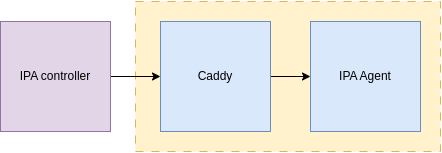

# IPA Agent
### Introduction
IPA agent is one of the key building blocks for Intelligent Pod Autoscaler. IPA controller uses IPA agent to analyze metrics and get scaling recommendations. It is a web application that uses GEMINI API to get scaling recommendations. 

### Usage
Internally, IPA makes a `POST` request with metrics in the body to the IPA agent. To make it function, base URL of the IPA agent is required to pass in `spec.metadata.llmAgent` path of the IPA custom resource manifest. IPA agent writes log to `llm.log` file.



##### Setup IPA Agent
IPA agent image `shafinhasnat/ipaagent` is available on docker hub. This image can be used to deploy self hosted IPA agent. This repo contains docker compose example file to deploy IPA agent.
```
docker compose up -d
```

##### API documentation
Required environment variable:

- `GEMINI_API_KEY` [required]
- `DUMP_DATASET` [optional]

Base URL: `https://ipaagent.shafinhasnat.me`
- `[GET]` `/` - IPA logs
- `[POST]` `/askllm` - Run LLM metrics analysis with Gemini API
Body: `{"metrics": <str>}`

---
*Team GG | Syed Shafin Hasnat | Humayra Akter*
